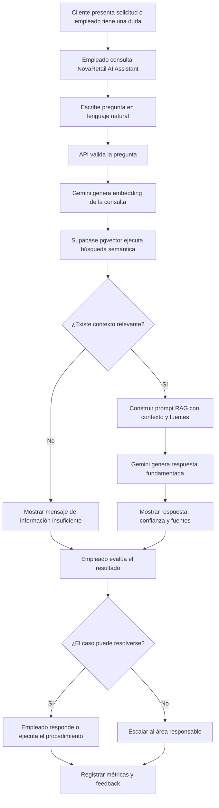
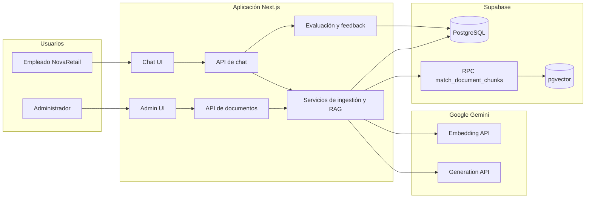

# Actividad 4: Integración con procesos empresariales

## NovaRetail AI Assistant

## 1. Resumen ejecutivo

NovaRetail AI Assistant es un prototipo de asistente interno de conocimiento que
integra inteligencia artificial generativa con el proceso de consulta de
políticas, procedimientos y manuales corporativos.

La solución permite que un administrador incorpore documentos PDF a una base de
conocimiento y que los empleados formulen preguntas en lenguaje natural. El
sistema recupera los fragmentos más relevantes, genera una respuesta basada
exclusivamente en ese contexto y muestra las fuentes utilizadas.

La aplicación cumple los puntos solicitados para la Actividad 4:

- Define un flujo empresarial completo.
- Implementa la interacción entre administrador, empleado y sistema.
- Integra APIs y servicios reales de Gemini y Supabase.
- Incluye una arquitectura actualizada.
- Incluye un flujo de proceso demostrable.
- Explica cómo el prototipo se integra en la operación de NovaRetail.

El prototipo es suficiente para la entrega académica. Las mejoras pendientes
corresponden principalmente a una evolución hacia producción y no impiden la
demostración del flujo empresarial.

## 2. Problema empresarial

Los empleados de NovaRetail necesitan consultar información distribuida en
manuales, políticas, procedimientos de devolución, garantías, logística,
atención al cliente y operación de tiendas.

El proceso manual presenta los siguientes problemas:

- Tiempo elevado para localizar información en múltiples documentos.
- Dependencia de supervisores o empleados con mayor experiencia.
- Riesgo de respuestas inconsistentes entre áreas o sucursales.
- Dificultad para verificar rápidamente la fuente de una respuesta.
- Mayor tiempo de atención y escalamiento de casos.

La solución propuesta centraliza la consulta de conocimiento sin reemplazar la
decisión humana. El asistente funciona como herramienta de apoyo: el empleado
consulta, revisa la respuesta y sus fuentes, y decide si resuelve o escala el
caso.

## 3. Actores

### Administrador de conocimiento

- Inicia sesión en el módulo de administración.
- Selecciona la categoría del documento.
- Carga documentos PDF internos.
- Verifica que el documento fue procesado.
- Consulta y elimina documentos cargados cuando corresponde.

### Empleado de NovaRetail

- Accede al centro de conocimiento.
- Formula una pregunta en lenguaje natural.
- Recibe una respuesta breve basada en documentos internos.
- Revisa el nivel de confianza y las fuentes recuperadas.
- Marca la respuesta como útil o no útil.
- Resuelve el caso o lo escala al área responsable.

### Sistema NovaRetail AI Assistant

- Valida las solicitudes.
- Extrae y divide el texto de los PDF.
- Genera embeddings con Gemini.
- Almacena documentos y vectores en Supabase PostgreSQL con pgvector.
- Ejecuta búsqueda semántica.
- Construye el prompt RAG.
- Genera respuestas fundamentadas y devuelve fuentes.
- Registra métricas de consultas y feedback.

## 4. Flujo completo del proceso

El proceso empresarial tiene dos subflujos: preparación de la base de
conocimiento y consulta operativa.

### 4.1. Preparación de la base de conocimiento

1. El administrador accede a la página de administración.
2. El sistema solicita la contraseña administrativa.
3. El administrador selecciona un PDF y una categoría documental.
4. La API valida la sesión, tipo de archivo y tamaño máximo.
5. El servicio de ingestión extrae el texto del PDF.
6. El texto se normaliza y divide en fragmentos con solapamiento.
7. Gemini genera un embedding de 768 dimensiones para cada fragmento.
8. Supabase almacena los metadatos del documento.
9. PostgreSQL con pgvector almacena los fragmentos y embeddings.
10. La interfaz confirma el documento, categoría y cantidad de fragmentos.

Si el PDF no contiene texto extraíble, supera 10 MB, tiene un formato no
admitido o falla un servicio externo, la carga se rechaza y se muestra un
mensaje de error.

### 4.2. Consulta y resolución operativa

1. Un cliente presenta una solicitud o un empleado tiene una duda interna.
2. El empleado abre NovaRetail Knowledge Center.
3. El empleado escribe una pregunta en lenguaje natural.
4. La API valida que la pregunta no esté vacía y no exceda el límite definido.
5. El sistema identifica interacciones conversacionales simples, como saludos.
6. Para una consulta de conocimiento, Gemini genera el embedding de la pregunta.
7. Supabase ejecuta la función `match_document_chunks`.
8. pgvector calcula similitud coseno y devuelve hasta cinco fragmentos por
   encima del umbral configurado.
9. Si no existe contexto relevante, el sistema devuelve el mensaje seguro:
   `I don't have enough information in the knowledge base to answer that.`
10. Si existe contexto, el sistema construye un prompt que restringe la
    respuesta a los fragmentos recuperados.
11. Gemini genera una respuesta concisa.
12. La API devuelve respuesta, confianza, documentos fuente, fragmentos,
    similitud y extractos.
13. El empleado revisa la respuesta y las fuentes.
14. El empleado resuelve el caso o lo escala.
15. El sistema registra tiempo de respuesta, confianza y uso del fallback.
16. El empleado puede registrar feedback útil o no útil.
17. La página de evaluación consolida métricas para seguimiento.

## 5. Diagrama del proceso empresarial

## 6. Interacción usuario-sistema

| Paso | Actor                    | Acción                     | Respuesta del sistema                                |
| ---- | ------------------------ | -------------------------- | ---------------------------------------------------- |
| 1    | Administrador            | Inicia sesión              | Crea una sesión HTTP-only válida por ocho horas      |
| 2    | Administrador            | Selecciona categoría y PDF | Valida autenticación, formato y tamaño               |
| 3    | Sistema                  | Procesa el PDF             | Extrae texto, crea fragmentos y embeddings           |
| 4    | Sistema                  | Persiste el contenido      | Guarda documento y fragmentos en Supabase            |
| 5    | Administrador            | Revisa documentos          | Visualiza categoría, tamaño y cantidad de fragmentos |
| 6    | Empleado                 | Formula una pregunta       | Valida y procesa la consulta                         |
| 7    | Sistema                  | Busca contexto             | Recupera fragmentos por similitud semántica          |
| 8    | Sistema                  | Genera la respuesta        | Devuelve texto, confianza y fuentes                  |
| 9    | Empleado                 | Revisa evidencia           | Abre fuentes, similitud y extractos                  |
| 10   | Empleado                 | Decide                     | Resuelve el caso o lo escala                         |
| 11   | Empleado                 | Envía feedback             | Registra respuesta útil o no útil                    |
| 12   | Responsable del proyecto | Consulta evaluación        | Visualiza documentos, consultas, tiempos y feedback  |

## 7. Arquitectura actualizada

La solución sigue una arquitectura web modular por capas.

### Capa de presentación

- Next.js App Router.
- React y TypeScript.
- Tailwind CSS y componentes estilo shadcn/ui.
- Chat, administración, arquitectura, flujo empresarial, evaluación y demo.

### Capa de API

- Route Handlers de Next.js.
- Validación de entradas con Zod.
- Autenticación administrativa mediante cookie HTTP-only firmada.
- Serialización de respuestas JSON.

### Capa de aplicación y dominio

- Servicio de ingestión documental.
- Servicio de consulta documental.
- Servicio de chat.
- Servicio de generación de embeddings.
- Servicio de generación de respuestas.
- Registro de consultas y feedback.
- Cálculo de métricas de evaluación.

### Capa de datos

- Supabase PostgreSQL.
- Extensión pgvector.
- Tablas `documents`, `document_chunks`, `chat_queries` y `chat_feedback`.
- Función RPC `match_document_chunks`.

### Servicios externos

- Gemini Embedding API con `gemini-embedding-001`.
- Gemini Generation API mediante Vercel AI SDK.

## 8. Diagrama de arquitectura

## 9. APIs y servicios

### APIs internas

| Método y ruta                       | Propósito                                               | Acceso                 |
| ----------------------------------- | ------------------------------------------------------- | ---------------------- |
| `POST /api/admin/login`             | Validar contraseña y crear sesión                       | Público con credencial |
| `POST /api/admin/logout`            | Eliminar sesión administrativa                          | Administrador          |
| `POST /api/documents/upload`        | Cargar, extraer, fragmentar, vectorizar y almacenar PDF | Administrador          |
| `DELETE /api/documents/:documentId` | Eliminar documento y fragmentos asociados               | Administrador          |
| `POST /api/chat`                    | Procesar pregunta y devolver respuesta RAG con fuentes  | Empleado               |
| `POST /api/chat/feedback`           | Registrar evaluación útil o no útil                     | Empleado               |

### Servicios internos principales

| Servicio                        | Responsabilidad                                                       |
| ------------------------------- | --------------------------------------------------------------------- |
| `document-ingestion.service.ts` | Coordinar validación, extracción, chunking, embeddings y persistencia |
| `document-query.service.ts`     | Ejecutar búsqueda semántica y transformar resultados                  |
| `chat.service.ts`               | Coordinar intención, recuperación, generación, fuentes y registro     |
| `embedding.service.ts`          | Generar y normalizar embeddings                                       |
| `generation.service.ts`         | Generar la respuesta con Gemini                                       |
| `extract-pdf-text.ts`           | Extraer texto mediante `unpdf`                                        |
| `chunk-text.ts`                 | Dividir texto con tamaño y solapamiento definidos                     |
| `build-rag-prompt.ts`           | Construir instrucciones que limitan la respuesta al contexto          |
| `chat-query-log.service.ts`     | Registrar métricas de cada consulta                                   |
| `chat-feedback.service.ts`      | Guardar la valoración del usuario                                     |
| `evaluation-metrics.service.ts` | Consolidar indicadores de uso y calidad                               |

### Servicios externos

#### Gemini API

Se utiliza para dos operaciones:

- Crear embeddings del contenido documental y de la pregunta.
- Generar la respuesta final restringida por el prompt RAG.

La integración está encapsulada en servicios específicos, evitando llamadas
directas desde componentes o controladores.

#### Supabase PostgreSQL con pgvector

Se utiliza para:

- Almacenar metadatos documentales.
- Almacenar fragmentos y vectores.
- Buscar fragmentos mediante similitud coseno.
- Registrar consultas, tiempos, confianza y fallback.
- Registrar feedback del empleado.

La clave secreta de Supabase se utiliza únicamente en el servidor.

## 10. Explicación de la integración empresarial

La aplicación se integra como una etapa de apoyo dentro del flujo existente de
atención y operación, no como un proceso independiente.

Antes del prototipo, el empleado debía buscar manualmente un procedimiento,
consultar a otro empleado o escalar el caso. Con el asistente, la búsqueda se
realiza al inicio del análisis del caso. La respuesta conserva trazabilidad
porque muestra el documento y fragmento recuperado.

Ejemplos de integración:

- **Devoluciones:** el asesor consulta requisitos, plazos y validaciones antes
  de aprobar o escalar una devolución.
- **Garantías:** el empleado verifica cobertura y condiciones desde el manual
  correspondiente.
- **Logística:** el asesor consulta el procedimiento para pedidos retrasados,
  perdidos o marcados como entregados.
- **Atención al cliente:** el empleado consulta criterios de escalamiento y
  guiones de resolución.
- **Operación de tiendas:** el personal consulta políticas y procedimientos
  internos.
- **Onboarding:** un nuevo empleado obtiene respuestas verificables sin
  depender constantemente de un supervisor.

La decisión final permanece en el empleado. Para casos críticos, ambiguos o sin
contexto suficiente, el flujo termina en escalamiento humano.

## 11. Manejo de excepciones

- Pregunta vacía o inválida: la API devuelve error de validación.
- PDF no válido o superior a 10 MB: la carga se rechaza.
- PDF escaneado sin texto: se informa que no contiene texto extraíble.
- Sin fragmentos relevantes: se devuelve el fallback obligatorio.
- Error de Gemini o Supabase: la API devuelve un error controlado.
- Documento inexistente: la eliminación devuelve estado 404.
- Usuario no autenticado en administración: se redirige al login o se devuelve
  estado 401.
- Fallo al guardar métricas: la respuesta del chat continúa disponible y el
  error solo se registra en desarrollo.

## 12. Indicadores disponibles

La aplicación registra y presenta:

- Cantidad de documentos cargados.
- Cantidad de fragmentos indexados.
- Categorías documentales cubiertas.
- Total de preguntas.
- Preguntas respondidas con contexto.
- Preguntas con información insuficiente.
- Tiempo promedio de respuesta.
- Respuestas con confianza alta, media y baja.
- Cantidad y porcentaje de feedback útil.

Estos indicadores permiten evaluar adopción, cobertura de la base de
conocimiento y calidad percibida.

## 13. Diagnóstico de cumplimiento

| Requisito de la entrega     | Estado | Evidencia                                                |
| --------------------------- | ------ | -------------------------------------------------------- |
| Flujo completo del proceso  | Cumple | Ingestión, consulta, resolución, escalamiento y feedback |
| Interacción usuario-sistema | Cumple | Interfaces de Chat, Admin, Evaluation y Demo             |
| APIs o servicios            | Cumple | APIs internas, Gemini y Supabase                         |
| Arquitectura actualizada    | Cumple | Página `/architecture` y diagrama de este documento      |
| Diagrama de proceso         | Cumple | Página `/business-flow` y diagrama de este documento     |
| Explicación de integración  | Cumple | Casos operativos y rol de apoyo a decisiones             |
| Documento técnico           | Cumple | Este documento                                           |
| Demo                        | Cumple | Página `/demo` y `docs/demo/demo-script.md`              |

## 14. Verificación técnica

Durante el diagnóstico se verificó que el proyecto:

- Usa TypeScript en modo estricto.
- Separa rutas, componentes, servicios y acceso a datos.
- Protege la administración y las APIs documentales.
- Usa las claves nuevas de Supabase.
- Mantiene la clave secreta únicamente en código de servidor.
- Implementa Gemini y Supabase reales, no respuestas simuladas.
- Devuelve fuentes, similitud y extractos.
- Implementa el fallback requerido.
- Incluye estados de carga, éxito, error y vacío.
- Incluye migraciones de base de datos.
- Incluye guion de demo y preguntas de prueba.
- Pasa `pnpm lint`.
- Pasa `pnpm typecheck`.
- Pasa `pnpm format:check`.
- Pasa `pnpm build`.

## 15. Mejoras recomendadas

Estas mejoras no son necesarias para aprobar la Actividad 4, pero serían
necesarias antes de un uso empresarial real:

### Prioridad alta para producción

- Reemplazar la contraseña compartida por autenticación corporativa y roles.
- Proteger o limitar el chat y el endpoint de feedback para evitar abuso.
- Incorporar rate limiting y cuotas para controlar costos de Gemini.
- Añadir versionado, vigencia, propietario y fecha de revisión de documentos.
- Añadir auditoría de acciones administrativas.

### Prioridad media

- Incorporar OCR para PDF escaneados.
- Conservar número de página para mejorar la precisión de las citas.
- Permitir filtros por departamento o categoría durante la recuperación.
- Procesar embeddings por lotes o mediante una cola para documentos grandes.
- Añadir pruebas unitarias e integración automatizadas.
- Ajustar el umbral de similitud con un conjunto de preguntas evaluadas.

### Prioridad futura

- Integrar el asistente con intranet, CRM, mesa de ayuda o Microsoft Teams.
- Añadir aprobación humana para procedimientos críticos.
- Exportar métricas y trazas para auditoría.
- Añadir notificaciones de documentos vencidos.

## 16. Conclusión

NovaRetail AI Assistant ya cumple la integración empresarial solicitada para la
Actividad 4. El proceso no se limita a una demostración aislada de IA: conecta
la administración del conocimiento, la consulta operativa, la verificación de
fuentes, la decisión humana y la evaluación del resultado.

No es necesario agregar una funcionalidad central nueva para esta entrega. La
recomendación es presentar el prototipo con un PDF representativo, ejecutar una
pregunta respondible, una pregunta fuera de alcance, mostrar las fuentes y
cerrar con las páginas de flujo empresarial, arquitectura y evaluación.
