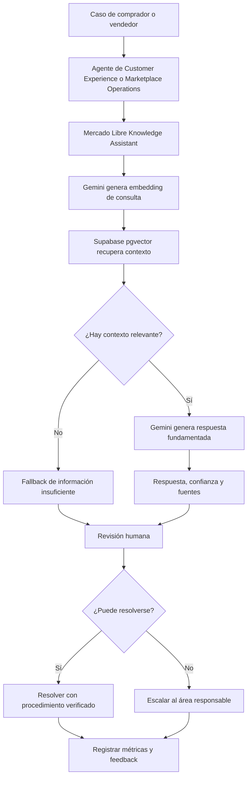
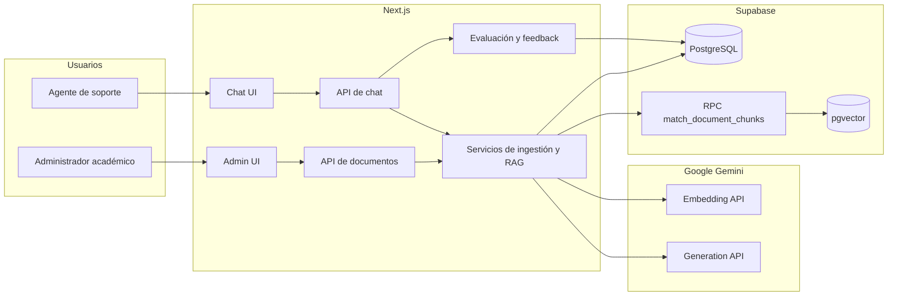

# Actividad 4: Integración con procesos empresariales

## Mercado Libre Knowledge Assistant

## 1. Resumen ejecutivo

Mercado Libre Knowledge Assistant es un prototipo académico de asistente de
conocimiento basado en Retrieval-Augmented Generation (RAG). El MVP está
delimitado a Argentina y a conocimiento operativo sobre Marketplace, Customer
Experience y Mercado Envíos: devoluciones, reembolsos, reclamos, protección al
comprador, incidentes de entrega y escalamiento.

La solución permite que un administrador incorpore documentos PDF permitidos a
una base de conocimiento. Un agente formula preguntas en lenguaje natural, el
sistema recupera los fragmentos más relevantes y Gemini genera una respuesta
exclusivamente a partir de ese contexto. La interfaz conserva las fuentes, el
nivel de confianza y el feedback.

Es un prototipo educativo independiente. No es un producto oficial de Mercado
Libre, no está afiliado ni respaldado por la empresa y no se conecta con APIs
privadas, CRM, tickets, empleados o políticas internas.

## 2. Problema empresarial y alcance

En una operación de marketplace, un agente debe localizar procedimientos
confiables mientras atiende casos de compradores o vendedores. La información
puede estar distribuida en documentos de devoluciones, reclamos, protección al
comprador, logística y escalamiento.

El proceso manual puede provocar:

- tiempo elevado para encontrar una fuente relevante;
- dependencia de personas con mayor experiencia;
- respuestas inconsistentes;
- dificultad para verificar la evidencia;
- escalamiento tardío o innecesario.

El asistente añade una etapa de consulta verificable sin sustituir la decisión
humana. El alcance excluye Mercado Pago, crédito, préstamos, inversiones,
publicidad y conocimiento general no relacionado.

## 3. Actores

### Administrador de conocimiento

- Inicia sesión con la autenticación simple del MVP.
- Selecciona la categoría y carga un PDF permitido.
- Confirma categoría, tamaño y cantidad de fragmentos.
- Elimina documentos obsoletos mediante el flujo existente.
- Verifica que cada fuente sea pública, académica o claramente simulada.

### Agente de Customer Experience o Marketplace Operations

- Recibe un caso de comprador o vendedor.
- Formula una pregunta en lenguaje natural.
- Revisa respuesta, confianza y fuentes.
- Marca la respuesta como útil o no útil.
- Decide si resuelve el caso o lo escala.

### Sistema Mercado Libre Knowledge Assistant

- Valida solicitudes y sesión administrativa.
- Extrae y fragmenta texto de PDF.
- Genera embeddings con Gemini.
- Almacena documentos y vectores en Supabase PostgreSQL con pgvector.
- Ejecuta recuperación semántica con umbral.
- Construye el prompt RAG y genera una respuesta fundamentada.
- Devuelve fuentes y registra métricas y feedback.

## 4. Flujo completo del proceso

### 4.1. Preparación de la base de conocimiento

1. El administrador accede a `/admin/login`.
2. El sistema crea una sesión firmada en una cookie HTTP-only.
3. El administrador selecciona un PDF permitido y una categoría.
4. La API valida sesión, formato y tamaño máximo de 10 MB.
5. El servicio de ingestión extrae el texto.
6. El texto se normaliza y divide en fragmentos con solapamiento.
7. Gemini genera un embedding de 768 dimensiones por fragmento.
8. Supabase almacena metadatos del documento.
9. PostgreSQL con pgvector almacena fragmentos y embeddings.
10. La interfaz confirma documento, categoría y cantidad de fragmentos.

Los documentos anteriores no se renombran ni eliminan automáticamente. Antes
de la demostración deben retirarse manualmente los PDF del caso ficticio previo
y cargarse el corpus académico para Mercado Libre Argentina.

### 4.2. Consulta, revisión y resolución

1. Un comprador o vendedor presenta un caso.
2. El agente de Customer Experience o Marketplace Operations abre el chat.
3. El agente escribe una pregunta en lenguaje natural.
4. La API valida longitud y contenido.
5. Para una consulta de conocimiento, Gemini genera el embedding de la pregunta.
6. Supabase ejecuta `match_document_chunks`.
7. pgvector devuelve hasta cinco fragmentos que superan el umbral.
8. Si no existe contexto suficiente, el sistema responde:
   `I don't have enough information in the knowledge base to answer that.`
9. Si existe contexto, el sistema construye un prompt restringido a esos
   fragmentos.
10. Gemini genera una respuesta concisa sin inventar políticas.
11. La API devuelve respuesta, confianza y fuentes.
12. El agente revisa documento, fragmento, extracto y similitud.
13. El agente decide si resuelve o escala.
14. El sistema registra comportamiento, tiempo de respuesta y feedback.

## 5. Diagrama del proceso empresarial

## 6. Interacción usuario-sistema

| Paso | Actor            | Acción                     | Respuesta del sistema                                 |
| ---- | ---------------- | -------------------------- | ----------------------------------------------------- |
| 1    | Administrador    | Inicia sesión              | Crea sesión HTTP-only válida por ocho horas           |
| 2    | Administrador    | Selecciona categoría y PDF | Valida autenticación, formato y tamaño                |
| 3    | Sistema          | Procesa el PDF             | Extrae texto, crea fragmentos y embeddings            |
| 4    | Sistema          | Persiste el contenido      | Guarda documento y fragmentos en Supabase             |
| 5    | Administrador    | Revisa documentos          | Muestra categoría, tamaño y cantidad de fragmentos    |
| 6    | Agente           | Formula una pregunta       | Valida y procesa la consulta                          |
| 7    | Sistema          | Busca contexto             | Recupera fragmentos por similitud                     |
| 8    | Sistema          | Genera respuesta           | Devuelve texto, confianza y fuentes                   |
| 9    | Agente           | Revisa evidencia           | Abre fuentes, similitud y extractos                   |
| 10   | Agente           | Decide                     | Resuelve o escala                                     |
| 11   | Agente           | Envía feedback             | Registra respuesta útil o no útil                     |
| 12   | Equipo académico | Consulta evaluación        | Ve documentos, consultas, tiempos, fuentes y feedback |

## 7. Arquitectura actualizada

La migración de dominio no modifica la arquitectura técnica:

### Capa de presentación

- Next.js App Router, React, TypeScript y Tailwind CSS.
- Chat, Knowledge Acquisition, Admin, Business Flow, Architecture, Evaluation y
  Demo.
- Sistema visual académico inspirado en Mercado Libre, sin logotipos ni activos
  propietarios.

### Capa de API

- Route Handlers de Next.js.
- Validación de límites con Zod.
- Autenticación administrativa mediante cookie firmada HTTP-only.
- Respuestas JSON y manejo explícito de errores.

### Capa de aplicación

- Servicios de ingestión, consulta documental, chat, embeddings y generación.
- Constructor de prompt RAG restringido al contexto.
- Registro de consultas, fuentes y feedback.
- Métricas calculadas desde la base de datos.

### Capa de datos

- Tablas `documents`, `document_chunks`, `chat_queries` y `chat_feedback`.
- Supabase PostgreSQL y extensión pgvector.
- Función RPC `match_document_chunks`.
- Migración aditiva `008` para nuevas categorías y compatibilidad histórica.

## 8. Diagrama de arquitectura

## 9. APIs y servicios

| Método y ruta                       | Propósito                                       | Acceso                 |
| ----------------------------------- | ----------------------------------------------- | ---------------------- |
| `POST /api/admin/login`             | Validar contraseña y crear sesión               | Público con credencial |
| `POST /api/admin/logout`            | Eliminar sesión administrativa                  | Administrador          |
| `POST /api/documents/upload`        | Extraer, fragmentar, vectorizar y almacenar PDF | Administrador          |
| `DELETE /api/documents/:documentId` | Eliminar documento y fragmentos                 | Administrador          |
| `POST /api/chat`                    | Responder con RAG, confianza y fuentes          | Usuario del prototipo  |
| `POST /api/chat/feedback`           | Registrar feedback útil o no útil               | Usuario del prototipo  |

| Servicio                        | Responsabilidad                                                  |
| ------------------------------- | ---------------------------------------------------------------- |
| `document-ingestion.service.ts` | Validación, extracción, chunking, embeddings y persistencia      |
| `document-query.service.ts`     | Búsqueda semántica y transformación de resultados                |
| `chat.service.ts`               | Intención, recuperación, generación, fuentes y registro          |
| `embedding.service.ts`          | Generación y normalización de embeddings                         |
| `generation.service.ts`         | Generación de respuesta mediante Gemini                          |
| `build-rag-prompt.ts`           | Restricción de la respuesta al contexto y alcance académico      |
| `evaluation-metrics.service.ts` | Métricas de documentos, consultas, fuentes, confianza y feedback |

## 10. Integración empresarial

El asistente se ubica al inicio del análisis del caso. Permite encontrar una
fuente antes de ejecutar un procedimiento o escalar. Los escenarios del MVP
incluyen:

- una compra marcada como entregada que el comprador no recibió;
- un producto dañado, incompleto o incorrecto;
- validaciones previas a una devolución;
- procedimiento posterior a un reembolso aprobado;
- reclamo recibido por un vendedor;
- incidente o excepción de Mercado Envíos;
- criterio de escalamiento documentado.

La herramienta no automatiza la decisión final. Si la evidencia falta, es
contradictoria o el caso es sensible, el agente debe escalar.

## 11. Manejo de excepciones

- Pregunta vacía o inválida: error de validación.
- PDF inválido o superior a 10 MB: carga rechazada.
- PDF escaneado sin texto: mensaje de extracción insuficiente.
- Categoría no permitida: error de validación.
- Sin fragmentos relevantes: fallback obligatorio.
- Error de Gemini o Supabase: respuesta de error controlada.
- Documento inexistente: estado 404 en eliminación.
- Sesión administrativa inválida: redirección o estado 401.
- Error al registrar métricas: el chat conserva la respuesta y registra el fallo
  solo en desarrollo.

## 12. Indicadores disponibles

La aplicación calcula desde Supabase:

- documentos cargados, fragmentos y categorías;
- preguntas totales;
- respuestas con fuentes visibles;
- tasa de respuestas respaldadas por fuentes;
- preguntas con fallback;
- interacciones conversacionales o no calificadas;
- tiempo promedio de respuesta;
- respuestas con confianza alta, media y baja;
- cantidad y porcentaje de feedback útil.

No se presenta una tasa de éxito de recuperación para consultas _in scope_
porque el esquema todavía no clasifica cada pregunta como _in scope_. Mostrarla
sin esa etiqueta produciría una métrica engañosa.

## 13. Diagnóstico de cumplimiento

| Requisito                   | Estado | Evidencia                                    |
| --------------------------- | ------ | -------------------------------------------- |
| Flujo empresarial completo  | Cumple | Ingestión, consulta, revisión y escalamiento |
| Interacción usuario-sistema | Cumple | Chat, Admin, Evaluation y Demo               |
| APIs y servicios reales     | Cumple | Gemini y Supabase                            |
| Arquitectura actualizada    | Cumple | `/architecture` y este documento             |
| Diagrama de proceso         | Cumple | `/business-flow` y Mermaid                   |
| Adquisición de conocimiento | Cumple | `/knowledge-acquisition`                     |
| Evaluación                  | Cumple | Métricas reales, riesgos y mitigaciones      |
| Demo                        | Cumple | `/demo` y `docs/demo/demo-script.md`         |

## 14. Seguridad y ética

- Las claves secretas permanecen en código de servidor.
- Admin y las APIs de documentos requieren sesión.
- No se cargan documentos privados, personales o no autorizados.
- El producto muestra un aviso académico y de no afiliación.
- No se declara acceso a especialistas o sistemas privados.
- Las fuentes humanas del mapa son propuestas para una implementación real.
- La generación se restringe al contexto y conserva fallback.
- Un humano valida el resultado y toma la decisión.

## 15. Mejoras recomendadas

### Prioridad alta para producción

- Autenticación corporativa, roles, auditoría y rate limiting.
- Propietario, país, vigencia, versión y revisión de documentos.
- Gobierno de fuentes y flujo de aprobación.

### Prioridad media

- OCR y citas por página.
- Etiqueta _in scope_ para calcular éxito de recuperación correctamente.
- Conjunto de evaluación validado y ajuste de umbral.
- Procesamiento por lotes o cola para documentos grandes.

### Prioridad futura

- Integraciones empresariales autorizadas.
- Aprobación humana formal para procedimientos críticos.
- Exportación de métricas y trazas para auditoría.

## 16. Conclusión

Mercado Libre Knowledge Assistant demuestra cómo integrar adquisición de
conocimiento, administración documental, recuperación semántica, generación
fundamentada, fuentes visibles, decisión humana y evaluación. El resultado es
suficiente para demostrar el flujo académico del MVP de 10 semanas, siempre que
se utilice un corpus permitido, actualizado y claramente identificado para el
escenario Argentina.
